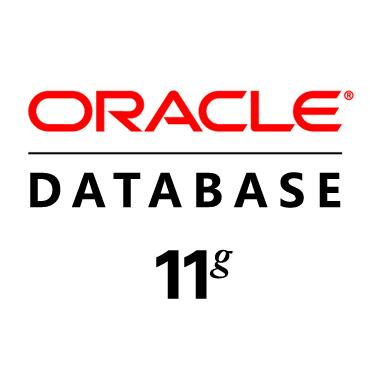
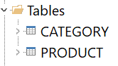
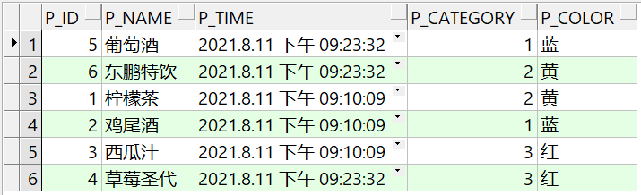
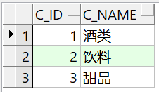
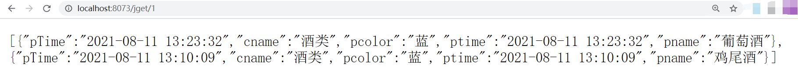
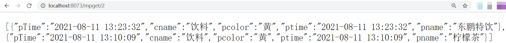

# 基于jdbc和MybatisPuls操作Oracle数据库



## 请求

``` java
// 基于jdbc的左连接查询
@RequestMapping("/jget/{id}")
public List<ProductDto> jdbcGet(@PathVariable(name = "id") Integer id){
  return dao.findByType(id);
}

// 基于mybatis-plus的左连接查询
@RequestMapping("/mpget/{id}")
public List<ProductDto> mybatisPlusGet(@PathVariable(name = "id") Integer id){
  return service.getDrinkByType(id);
}
```

## 案例










